<!---->

 

 

## About Me

I'm a full-stack engineer with 3.5+ years of experience at Software AG and IBM. I work on backend systems, performance and system design, and I like debugging more than is probably healthy. I also build things at hackathons, some of which have gone well.

 

## Stack

| **Category**   | **Technologies** |
|----------------|------------------|
| **Frontend**   |   |
| **Backend**    |   |
| **Languages**  |     |
| **Databases**  |    |
| **Other Tools**|    |

 

Best way to reach me is [LinkedIn](https://www.linkedin.com/in/hariharan-sv/).

<!--## &#x1f4c8; GitHub Stats

&nbsp;&nbsp;&nbsp;&nbsp;
-->
<!--
**Hariharan-SV/Hariharan-SV** is a ✨ _special_ ✨ repository because its `README.md` (this file) appears on your GitHub profile.

Here are some ideas to get you started:

- 🔭 I’m currently working on ...
- 🌱 I’m currently learning 
- 👯 I’m looking to collaborate on projects.
- 🤔 I’m looking for help with ...
- 💬 Ask me about ...
- 📫 How to reach me: ...
- 😄 Pronouns: ...
- ⚡ Fun fact: ...
-->
